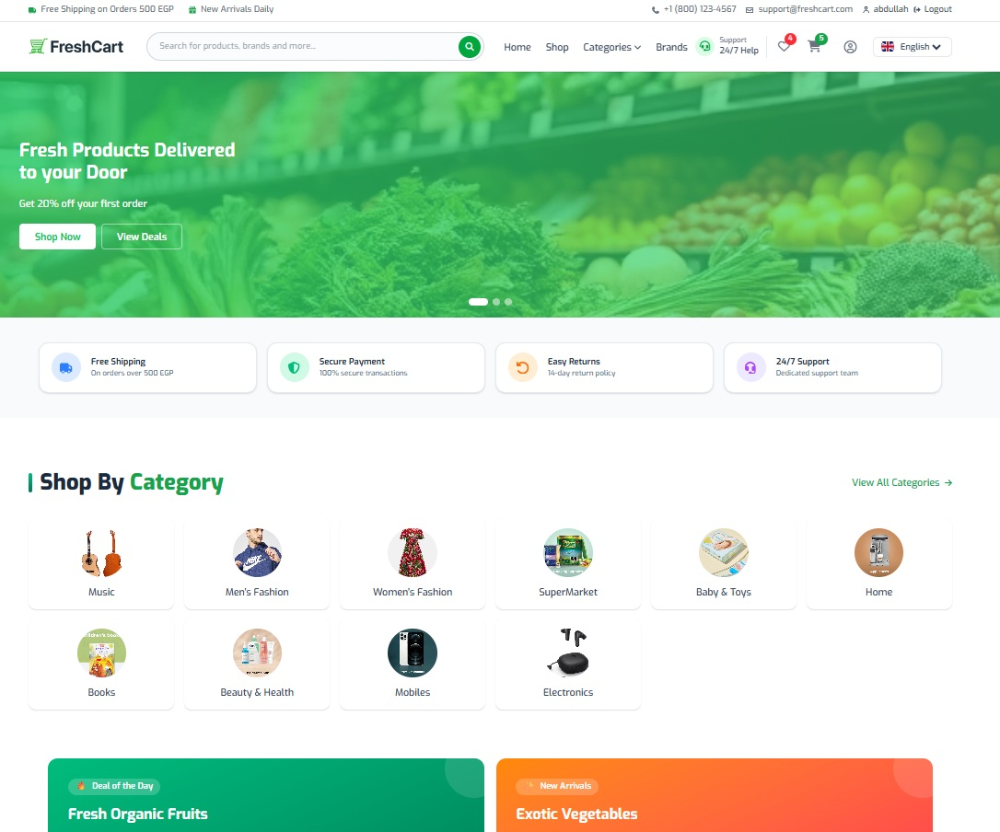
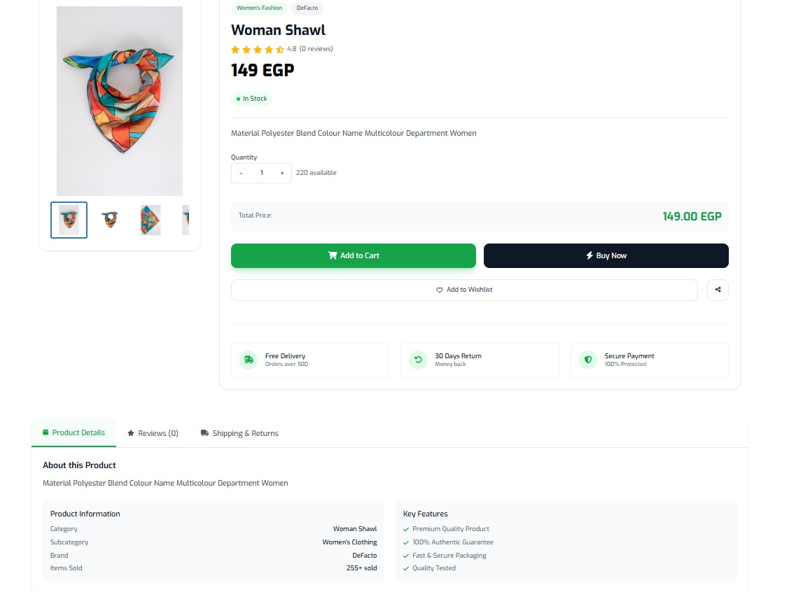
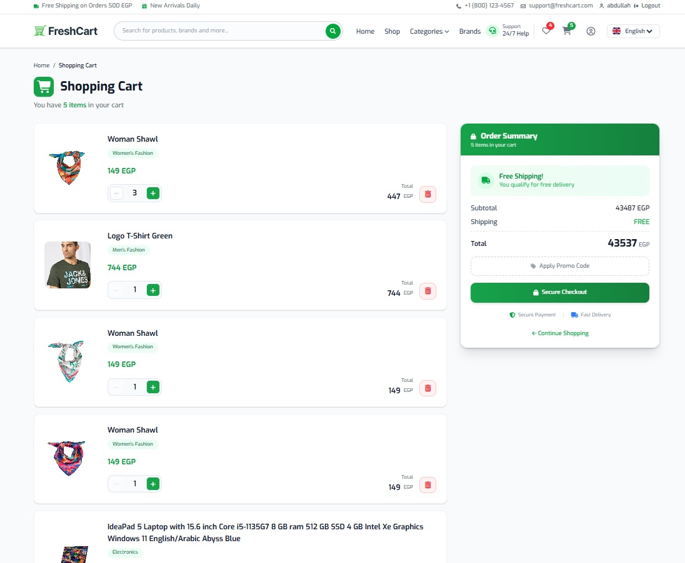
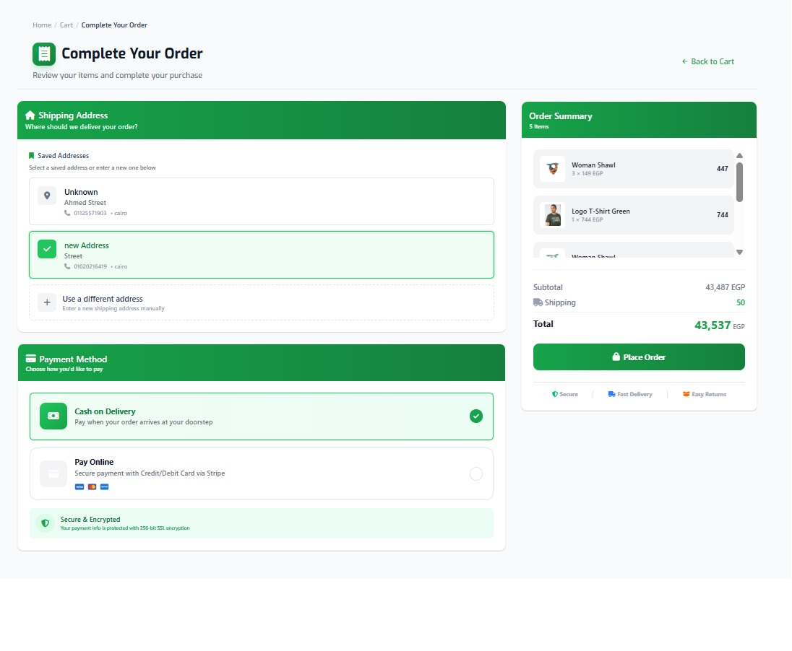

# 🛒 Fresh Cart - E-Commerce Web App

A modern and responsive E-Commerce web application built with **Angular 21**, featuring a scalable architecture, dynamic UI, and seamless multilingual experience.

🔗 **Live Demo:**
https://e-commerce-fresh-cart-production.netlify.app/home

---

## 🚀 Features

* 🛍️ Browse products with categories & filters
* ⭐ Product details with ratings & reviews
* 🛒 Add to cart & manage cart items
* 💳 Checkout flow (UI ready)
* 🌐 Multi-language support (English / Arabic)
* 🔄 RTL / LTR dynamic layout switching
* ⚡ Reactive state management using Angular Signals
* 🎨 Modern UI with Tailwind CSS
* 📱 Fully responsive design
* 🔁 Dynamic translation system (ngx-translate)

---

## 🧠 Tech Stack

* **Frontend:** Angular 21
* **State Management:** Angular Signals
* **Styling:** Tailwind CSS
* **UI Components:** Custom components (no UI library)
* **Carousel/Slider:** Swiper Web Components
* **Internationalization:** ngx-translate
* **API Integration:** RESTful APIs

---

## 📸 Screenshots

### 🏠 Home Page


### 🛍️ Product Details


### 🛒 Cart Page


### 💳 Checkout


---

## ⚙️ Installation

```bash id="v9k2md"
# Clone the repository
git clone https://github.com/your-username/fresh-cart.git

# Navigate into the project
cd fresh-cart

# Install dependencies
npm install

# Run development server
ng serve
```

---

## 🌍 Environment Setup

Configure your API base URL in:

```ts id="kq81pl"
src/environments/environment.ts
```

---

## 🧩 Project Structure

```id="zq82lx"
src/
│── app/
│   ├── core/        # services, guards, constants
│   ├── shared/      # reusable components
│   ├── features/    # feature modules (products, cart, checkout, etc.)
│  
│
│── assets/
│── environments/
```

---

## 🔥 Key Highlights

* Built with **modern Angular (standalone + signals)**
* Clean and scalable architecture
* Fully reactive UI
* Supports **RTL/LTR switching dynamically**
* Integrated **Swiper Web Components** with proper lifecycle handling
* Complete **multi-language (i18n) support with ngx-translate**
* No external UI library — fully custom UI components

---

## 📌 Future Improvements

* 🔐 Authentication & authorization
* 💳 Payment gateway integration (Stripe / PayPal)
* 📦 Order history & tracking system
* ❤️ Wishlist feature
* 🧪 Unit & end-to-end testing

---

## 🤝 Contributing

Contributions are welcome! Feel free to fork the repo and submit a pull request.

---

## 📄 License

This project is licensed under the MIT License.

---

## 👨‍💻 Author

**Abdalla Mohamed**

---

⭐ If you like this project, consider giving it a star!
